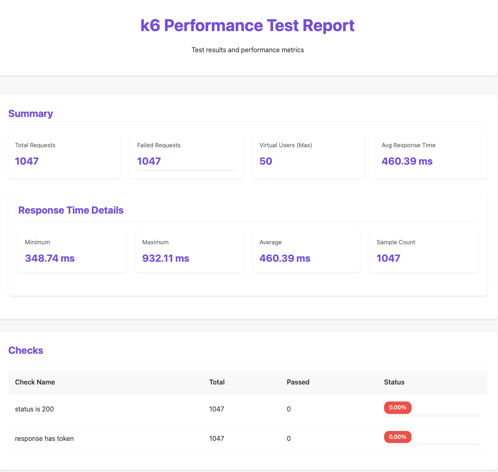

# k6 & Playwright Tests — README


This repository contains small test scripts for two purposes:
- UI automation with Playwright: `playwright-login-test.js`
- Load testing with k6: `k6-login-test.js`

It also contains a lightweight HTTP login check (`http-login-test.js`) and a small report generator that converts k6 NDJSON output to a basic HTML report (`generate-k6-report.js`).

This README explains how to run the Playwright tests and the k6 test, generate a JSON results file, and create a simple HTML report on macOS (zsh). It includes Docker fallbacks so you don't have to install everything on your host.

## Prerequisites

- Node.js 18+ (you have v24 in this environment). Check with:
```bash
node -v
```
- npm (bundled with Node) or yarn
- Docker (recommended for k6 runs and if Playwright's browsers have host issues)
- Optional: Homebrew (for installing `k6` or system libs)

## Files in this repo

- `playwright-login-test.js` — Playwright script (browser UI). Uses `#username`, `#password` and `#submit-login` on https://practice.expandtesting.com/login. Requires Playwright browsers to be installed.
- `http-login-test.js` — HTTP-only login sample (no browser). Useful for smoke checks.
- `k6-login-test.js` — k6 script (load test configuration and test logic).
- `results.json` — generated when running k6 with JSON output (created by k6 run)
- `generate-k6-report.js` — Node script that parses `results.json` and writes `k6-report.html` (basic HTML summary).

---

## Playwright — quick run

1. Install the Playwright package and download browsers (run from project root):

```bash
npm install playwright
npx playwright install
```

2. Run the script with Node:

```bash
node playwright-login-test.js
```

Notes and troubleshooting:
- If Playwright's Chromium crashes on macOS (you may see `Page crashed`), try launching with sandbox args or running in Docker.
  - Example sandbox flags are already used in the script: `--no-sandbox --disable-setuid-sandbox`.
- To debug visually, edit the script and set headless to `false` when launching the browser:
```js
await chromium.launch({ headless: false });
```
- If Playwright Firefox fails with XPCOM / libnss errors, that's a missing native library issue on your host; run Playwright inside Docker (see below) or install the required libs via Homebrew.

Alternative: run Playwright inside the official Playwright Docker image (isolated, recommended if browsers fail locally):

```bash
docker run --rm -v $(pwd):/work -w /work mcr.microsoft.com/playwright:focal node playwright-login-test.js
```

Replace `focal` with a tag that matches your needs; this image has browsers and dependencies preinstalled.

---

## HTTP smoke test

This doesn't require browsers — it posts form data to the `/authenticate` endpoint.

Run:

```bash
node http-login-test.js
# or via npm script if present
npm run http-login
```

Expected: the script prints `✅ HTTP login successful` (it checks final URL / response text).

---

## k6 — run locally (Docker recommended)

Option A — run k6 with Docker (recommended; no host install required):

```bash
# from project root (macOS zsh)
docker run --rm -v "$(pwd)":/scripts -w /scripts grafana/k6 run k6-login-test.js
```

If you need a JSON output file for reporting, run:

```bash
docker run --rm -v "$(pwd)":/scripts -w /scripts grafana/k6 run --out json=/scripts/results.json k6-login-test.js
```
or

```bash
docker run --rm -v "/Users/kunnath/Projects/k6":/scripts -w /scripts grafana/k6 run --out json=/scripts/results.json k6-login-test.js && node generate-k6-report.js
```

Notes for Apple Silicon (M1/ M2 / arm64):
- `loadimpact/k6:latest` may not have an arm64 manifest and fail to run. The `grafana/k6` image in most cases is multi-arch and works on Apple Silicon.
- If you encounter a `no matching manifest` error, try running with emulation (slower) or install k6 natively via Homebrew (option B below):

```bash
docker run --rm --platform linux/amd64 -v "$(pwd)":/scripts -w /scripts loadimpact/k6 run --out json=/scripts/results.json k6-login-test.js
```

Option B — install k6 locally with Homebrew (native):

```bash
brew update
brew install k6
cd /Users/kunnath/Projects/k6
k6 run --out json=results.json k6-login-test.js
```

---

## Generate HTML report from k6 JSON

After you have `results.json` (produced by k6 with `--out json=/scripts/results.json`), generate a basic HTML report with the included Node script:

```bash
node generate-k6-report.js
# opens the generated report on macOS
open k6-report.html
```

The generator produces a simple `k6-report.html` that includes summary metrics and check pass rates.

Notes:
- Community reporters exist but may not be available on npm or may require additional setup. The local generator is intentionally minimal and self-contained.

---

# k6 Performance Testing Report Generator

A simple tool to generate performance test reports from k6 JSON output in a modern HTML format.

## Prerequisites

- Node.js 18+ (check with `node -v`)
- k6 (via Docker or Homebrew)
- A k6 test script (e.g., `k6-login-test.js`)

## Quick Start

1. Run your k6 test with JSON output:

```bash
# Using Docker
docker run --rm -v "$(pwd)":/scripts -w /scripts grafana/k6 run --out json=/scripts/results.json k6-login-test.js

# Or using local k6 installation
k6 run --out json=results.json k6-login-test.js
```

2. Generate the HTML report:

```bash
node generate-k6-report.js
```

3. Open the generated report:

```bash
open k6-report.html  # on macOS
```

## Report Features

The generated report includes:
- Summary statistics (total requests, failures, VUs)
- Response time metrics (min, max, avg)
- Check results with visual progress bars
- Modern, responsive design
- Visual status indicators

## Required Parameters

For k6 test run:
- `--out json=results.json`: Specifies JSON output file location
- Path to your test script (e.g., `k6-login-test.js`)

For report generation:
- Input: Expects `results.json` in the same directory
- Output: Generates `k6-report.html` in the same directory

## File Structure

- `k6-login-test.js` - Your k6 test script
- `results.json` - k6 JSON output (generated during test run)
- `generate-k6-report.js` - Report generator script
- `k6-report.html` - Generated HTML report

## Troubleshooting

- If `results.json` is not found, ensure your k6 test completed successfully
- For Docker users on Apple Silicon (M1/M2):
  ```bash
  docker run --rm --platform linux/amd64 -v "$(pwd)":/scripts -w /scripts grafana/k6 run --out json=/scripts/results.json k6-login-test.js
  ```
- Check file permissions if the report isn't generating

---

## Quick troubleshooting checklist

- Playwright: `Page crashed` — try running the Playwright Docker image or add/adjust launch args (e.g., `--no-sandbox`) and run headful for debugging.
- Playwright Firefox XPCOM error — missing/macOS native library mismatch. Use the Playwright Docker image or install/upgrade host libraries (Homebrew `nss`) if you want to run native Firefox.
- k6 Docker image manifest error on Apple Silicon — use `grafana/k6` image (multi-arch) or run with `--platform linux/amd64` (emulated) or install k6 via Homebrew.
- If you get unexpected 4xx/5xx responses from `k6-login-test.js`, validate the endpoints locally with `curl` or the `http-login-test.js` script to ensure the service/paths are correct.

---

## Security & etiquette

- Don't run load tests (k6) against third-party production systems without permission. Use the practice site or your staging environment.

---

If you want, I can:
- Add an npm script to generate the HTML report (e.g., `npm run k6-report`).
- Improve the HTML report with percentiles and charts (Chart.js embedded). 
- Convert `playwright-login-test.js` to Playwright Test format and add a `npm test` script.

Tell me which follow-up you'd like and I'll implement it.
# Modern-frameworks-Playwright.K6
